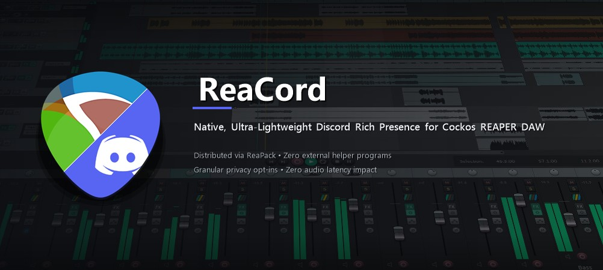

# ReaCord 🎧💬

<p align="center">
  
</p>



> **Native, Ultra-Lightweight Discord Rich Presence for Cockos REAPER DAW**  
> Distributed via ReaPack • Zero external helper programs • Granular privacy opt-ins • Zero audio latency impact

---

## Overview

**ReaCord** is a native C++ REAPER extension plugin (`reaper_reacord`) that connects REAPER directly to the Discord desktop client via local IPC.

Unlike previous scripts or third-party wrappers, **ReaCord runs entirely inside REAPER without requiring any standalone background programs, Python installations, or Node.js runtimes**. It is designed from the ground up for professional audio workstations where CPU efficiency, memory economy, and zero DSP buffer interference are paramount.

---

## ✨ Features

- **🚀 Zero External Executables**: Pure native REAPER extension (`.dll` on Windows, `.dylib` on macOS, `.so` on Linux).
- **📦 1-Click ReaPack Distribution**: Easily install, update, and manage directly through REAPER's ReaPack package manager.
- **🛡️ Granular Privacy Controls**: You choose exactly what is visible to the world:
  - **Project Title**: Choose between Full Filename, Name Only, Generic (*"Working on a Project"*), or completely Hidden.
  - **Session Time**: Choose between Project Elapsed Time, REAPER Uptime, or Hidden.
  - **Playback State**: Show detailed playback status with tempo (*"Playing @ 128 BPM"*), simple status (*"Recording"*), or Hidden.
  - **Track Count**: Toggle track count display (*"• 24 Tracks"*).
  - **🕵️ Incognito Mode**: Instant one-click stealth mode that masks all project and session information.
- **⚡ Zero Performance Overhead**:
  - Background worker thread communicates asynchronously using non-blocking I/O.
  - REAPER's real-time audio thread is **never** touched or blocked.
  - Consumes **< 2 MB RAM** and **< 0.01% CPU**.
  - Intelligent dirty-state hashing and rate-limiting prevents unnecessary socket traffic.
- **🎨 Dual Interface Options**:
  - **Native REAPER Dialog (SWELL)**: Fast, native OS styling with zero dependencies.
  - **ReaImGui Companion**: Modern hardware-accelerated dark UI with a **live interactive Discord profile card preview**.

---

## 📥 Installation

### Method 1: Via ReaPack (Recommended)

1. Open REAPER.
2. In the top menu, navigate to **Extensions > ReaPack > Import Repositories...**
3. Paste the ReaCord repository URL:
   ```text
   https://raw.githubusercontent.com/BartekStaniak/ReaCord/main/index.xml
   ```
4. Go to **Extensions > ReaPack > Browse Packages...**
5. Search for `ReaCord`, right-click and select **Install**.
6. Click **Apply** in the bottom-right corner and restart REAPER.

---

### Method 2: Manual Installation

1. Download the latest pre-compiled binary for your operating system from [Releases](https://github.com/BartekStaniak/ReaCord/releases):
   - **Windows (x64)**: `reaper_reacord64.dll`
   - **macOS (Universal - Apple Silicon & Intel)**: `reaper_reacord.dylib`
   - **Linux (x86_64)**: `reaper_reacord-x86_64.so`
2. In REAPER, go to **Options > Show REAPER resource path in explorer/finder**.
3. Open the `UserPlugins` folder (create it if it doesn't exist).
4. Copy the downloaded binary into `UserPlugins`.
5. Restart REAPER.

---

## ⚙️ Configuration & GUI

ReaCord provides multiple ways to configure your presence:

### 1. Top Menu Bar (Extensions Menu)
Navigate directly to REAPER's top menu bar:  
👉 **Extensions > ReaCord Settings...**

### 2. Action List & Hotkeys
Open REAPER's **Action List** (`?` key), search for `ReaCord: Open Settings...`, and press **Run**. You can also bind this action to any keyboard shortcut or toolbar icon.

ReaCord also includes a quick stealth action:
- `ReaCord: Toggle Incognito Mode`

### 3. ReaImGui Modern Interface (Optional)
If you have **ReaImGui** installed (available via ReaPack), run the companion script:
```text
scripts/ReaCord_Settings_ImGui.lua
```
This opens a modern dark floating window displaying real-time connection telemetry and an interactive **live Discord profile card preview**.

---

## 🖼️ Discord Application & Artwork Setup

ReaCord works **100% plug-and-play out of the box** using the official pre-configured REAPER Application ID (`1462972195658534965`).

If you wish to create your own custom Discord application, custom app name, or custom icons, pre-rendered 512x512 transparent PNG assets are provided directly in [`assets/discord/`](assets/discord/):
- `reacord_logo.png` (hybrid REAPER / Discord diagonal split emblem)
- `reaper_logo.png` (classic REAPER guitar pick)
- `play.png` (playback badge)
- `record.png` (recording badge)
- `pause.png` (pause badge)
- `stop.png` (idle/stopped badge)

See the step-by-step guide in [docs/DISCORD_APP_SETUP.md](docs/DISCORD_APP_SETUP.md) for custom developer setup instructions.

---

## 🏗️ Architecture Overview

```
[ REAPER Realtime Audio Engine ] ---> [ UNTOUCHED / ZERO OVERHEAD ]
               |
[ REAPER Main Thread ] (Timer hook @ 0.6 Hz)
               |  (Sanitizes state & applies privacy opt-ins)
       [ Lock-Free Snapshot ]
               |  (Double-buffered exchange)
[ ReaCord Worker Thread ] (Asynchronous Event Loop)
               |  (Non-blocking rate-limiting & dirty hash check)
[ Local IPC Pipe / Domain Socket ]
               |
[ Discord Desktop Client ]
```

---

## 🔨 Building From Source

### Prerequisites
- CMake 3.16+
- C++17 compatible compiler:
  - **Windows**: Visual Studio 2019/2022 (MSVC)
  - **macOS**: Xcode / Apple Clang
  - **Linux**: GCC or Clang + GTK3 development headers (`sudo apt install libgtk-3-dev`)

### Build Steps

```bash
# 1. Clone repository with submodules
git clone --recursive https://github.com/BartekStaniak/ReaCord.git
cd ReaCord

# 2. Configure build
cmake -B build -DCMAKE_BUILD_TYPE=Release

# 3. Compile
cmake --build build --config Release
```

The compiled binary will be placed in `build/Release/` (Windows) or `build/` (macOS/Linux).

---

## 👤 Author

Developed by **Bartek Staniak**  
GitHub: [@BartekStaniak](https://github.com/BartekStaniak)

---

## 📄 License

This project is licensed under the [MIT License](LICENSE) by Bartek Staniak.  
Cockos WDL and REAPER SDK are licensed under their respective Cockos licenses.
